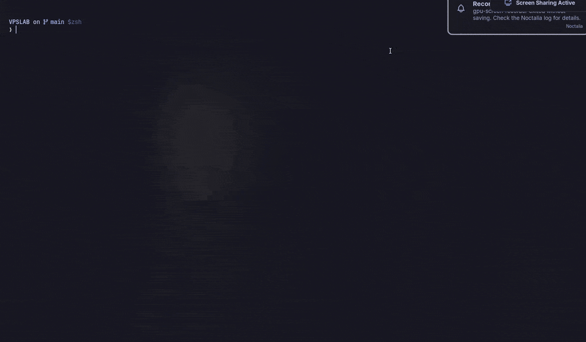

# Ubuntu VPS Lab



Disposable Ubuntu 24.04 server-like nodes on your workstation for testing deployments and
DevOps/SRE automation over SSH, without renting machines.

Each node runs systemd as PID 1, sshd, sudo, cron and journald, has a static private IP, and
installs packages with `apt`. systemd is there on purpose: the point is to exercise real services,
timers and logs, not just a shell.

```text
make ── scripts/lab.sh ── docker compose
                            ├── vps-01   10.80.0.11   127.0.0.1:2201
                            ├── vps-02   10.80.0.12   127.0.0.1:2202
                            └── vps-03   10.80.0.13   127.0.0.1:2203
                                 Ubuntu 24.04 · systemd · sshd · cron · journald
```

> Nodes are containers, not VMs. They share the host's kernel, clock and disks. Kernel upgrades,
> boot, clock skew and power-loss durability cannot be tested here, and `free`/`nproc` report the
> host's resources.

## Requirements

- Linux with cgroup v2
- Docker Engine with Compose v2
- OpenSSH client
- Free: ports `2201-2203` on `127.0.0.1` and subnet `10.80.0.0/24`

Tested on Arch Linux x86_64, kernel 7.2, cgroup v2, Docker Engine 29.8, Compose 5.6.

## Quick start

```bash
make up        # build the image, start vps-01..03, trust host keys, run checks
make test      # 38 checks across the fleet
make ssh 02    # ssh deploy@vps-02
make down      # remove the nodes
```

`make up` ends with one `ok` line per node, `make test` with `0 failed`.

## Nodes

| Node | SSH | Private IP |
| --- | --- | --- |
| vps-01 | `127.0.0.1:2201` | `10.80.0.11` |
| vps-02 | `127.0.0.1:2202` | `10.80.0.12` |
| vps-03 | `127.0.0.1:2203` | `10.80.0.13` |

Nodes reach each other by name (`ping vps-02`) or IP.

Each node is capped at 1 CPU, 1 GiB of memory and 2048 processes, like a small VPS. The caps are
enforced, but `free` and `nproc` inside a node still report the host's totals.

## Commands

| Command | Does |
| --- | --- |
| `make up` | Build and start the fleet, write `keys/known_hosts` and `keys/ssh_config`, run `check` |
| `make check` | Over SSH, per node: hostname, systemd running, sudo working |
| `make test` | Full smoke test: identity, SSH policy, networking, sandboxing, isolation, caps |
| `make ssh 02` | SSH as `deploy` |
| `make console 02` | Root shell through Docker. Works when SSH is broken |
| `make ps` | Container status |
| `make logs 02` | Last 100 journal lines |
| `make stop` / `make start` | Power off / on. Files, packages and services are kept |
| `make down` | Remove the nodes. Everything inside them is lost; the login key is kept |
| `make reset` | `down`, then `up` with fresh nodes |

Reboot from inside a node with `sudo reboot`.

## Access

Users are `root` and `deploy` (passwordless sudo). Login is key-only; password login is disabled.

`make up` generates the login key in `keys/` and reads each node's host key directly from the
container, so the first SSH connection is already verified. Use the generated config with any
OpenSSH tool:

```bash
ssh -F keys/ssh_config vps-01
scp -F keys/ssh_config app.tar.gz vps-01:/tmp/
```

Recreated nodes (`make down` / `make reset`) get new host keys; `make up` rewrites
`keys/known_hosts`.

## Extending

Keep the base image generic. Add project packages in the project's own image:

```dockerfile
FROM vpslab/ubuntu:24.04
RUN apt-get update \
    && apt-get install -y --no-install-recommends nginx git \
    && rm -rf /var/lib/apt/lists/*
```

Data that must survive `make down` belongs on a named volume at a data path such as `/opt` or
`/var/lib/<app>`, declared in the project's compose file.

## Security

- Nodes run without `--privileged`, in their own cgroup namespace, with two added capabilities:
  - `NET_ADMIN` for firewall and routing inside the node.
  - `SYS_ADMIN`, which is broad. It is needed because without it systemd silently skips unit
    sandboxing (`ProtectSystem`, `PrivateTmp`), so a hardened unit that fails on a real server
    would pass here. `make test` asserts sandboxing applies.
- Clock, kernel modules and raw devices stay denied: nodes cannot change the host clock and have no
  block device nodes. `make test` asserts both.
- Only the public key is mounted into nodes. `keys/` is git-ignored; never commit it or reuse it.
- SSH ports listen on `127.0.0.1` only.
- Containers are not a security boundary. Do not run untrusted code in the lab.

## Troubleshooting

| Symptom | Fix |
| --- | --- |
| `Pool overlaps with other one on this address space` | Another network uses `10.80.0.0/24`; change the subnet and IPs in `compose.yaml` |
| `port is already allocated` | Something else uses `2201-2203`; change the ports in `compose.yaml` |
| `make check` shows `FAIL` | `make console 02` then `systemctl --failed` |
| `Host key verification failed` | The node was recreated outside `make up`; run `make up` |
| `bind source path does not exist` | `docker compose up` was run directly; run `make up` |

## License

MIT
